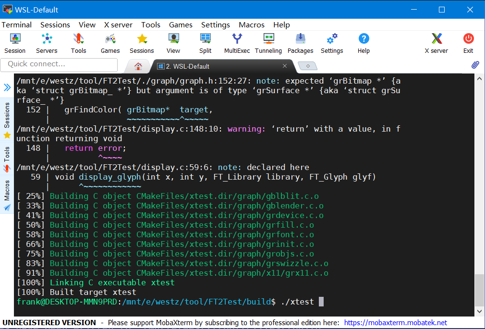
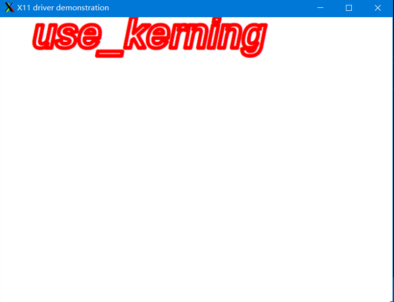

# FT2Test
WSL下的Freetype测试环境，使用x11绘图，WSL下安装x11后，通过MobaXterm访问WSL可以使用x11显示Freetype的结果。

## 安装方法
在WSL下
1. 下载
```
git clone https://github.com/lgl88911/FT2Test.git -b WSL
```
2. 编译
```
cd ./FT2Test
mkdir ftbuild
cd ./ftbuild
cmake -D CMAKE_INSTALL_PREFIX=$PWD/../INSTALL \
    -D CMAKE_DISABLE_FIND_PACKAGE_ZLIB=TRUE \
    -D CMAKE_DISABLE_FIND_PACKAGE_BZip2=TRUE \
    -D CMAKE_DISABLE_FIND_PACKAGE_PNG=TRUE \
    -D CMAKE_DISABLE_FIND_PACKAGE_HarfBuzz=TRUE \
    -D CMAKE_DISABLE_FIND_PACKAGE_BrotliDec=TRUE \
    ../freetype/
make
make install
cd ../
mkdir build
cd ./build
cmake ../
make
```

3. 运行
生成的可执行文件为`xtest`
```
./xtest
```
效果如下

